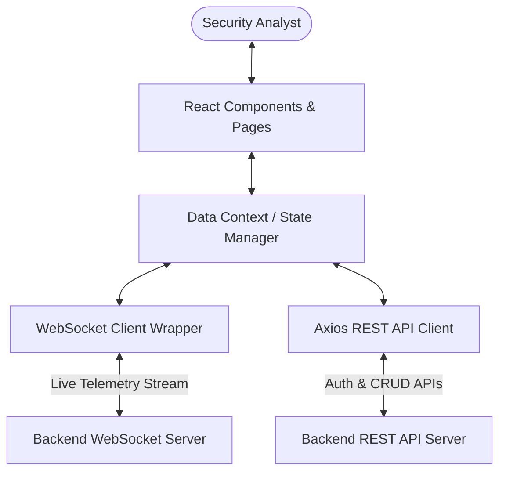

# 🛡️ Insider Guardian - Enterprise EDR Security Dashboard

<div align="center">
  
</div>

Insider Guardian is a next-generation, enterprise-grade Endpoint Detection and Response (EDR) frontend dashboard. Engineered for Security Operations Centers (SOC), it enables security analysts to monitor real-time endpoint telemetry, investigate complex threat incidents, and orchestrate automated response playbooks through a high-fidelity, hardware-accelerated interactive interface.

---

## 🚀 Key Features

* **🔌 Real-Time Telemetry Stream**: Live WebSocket client ingestion for instant threat event popups, incident alerts, and real-time host status synchronization.
* **📊 Visual Threat Analytics**: High-performance declarative charting utilizing `Recharts` to visualize severity distribution, incident velocity, and host health graphs.
* **✨ Premium Micro-interactions**: Smooth page layouts, responsive grids, and high-performance physics-based transition animations powered by `GSAP` (GreenSock).
* **🔒 Enterprise Resilience**: Automatic JWT session renewal using interceptor queues on HTTP `401 Unauthorized` responses, combined with type-safe schema verification using `Zod`.
* **⚙️ Interactive Operations**: Complete host isolation triggers, threat state lifecycle management (New, In-Progress, Contained, Resolved), and analyst note assignment.

---

## 🧬 Architecture & Logic Flow

Below is the client-side system architecture and telemetry flow inside Insider Guardian:



---

## 🛠️ Technology Stack & Badges

### Core Frontend Stack
[](https://react.dev/)
[](https://www.typescriptlang.org/)
[](https://vite.dev/)
[](https://tailwindcss.com/)

### UI & Animations
[](https://greensock.com/gsap/)
[](https://recharts.org/)
[](https://www.radix-ui.com/)
[](https://zod.dev/)

---

## 📂 Folder Structure

```text
insider-guardian/
├── index.html         # HTML SPA bootstrap
├── vite.config.ts     # Bundling & path configurations
├── tailwind.config.js # Custom design tokens & colors
├── src/
│   ├── main.tsx       # Entry mount point
│   ├── App.tsx        # Base layout & router coordinator
│   ├── App.css        # Global layout classes
│   ├── index.css      # Core Tailwind directives & style tokens
│   ├── components/    # Reusable atomic UI components (charts, modals, table-rows)
│   ├── config/        # API endpoints & environment constants
│   ├── context/       # Auth context and telemetry socket state
│   ├── hooks/         # Custom React hooks (telemetry, query, debounce)
│   ├── lib/           # Clients wrappers (REST interceptors & socket emitters)
│   ├── pages/         # Full layouts (Overview Dashboard, Alert Logs, Settings)
│   └── types/         # Strict TypeScript interface schemas
```

---

## 🚀 Getting Started

### Prerequisites
- Node.js (v18.0.0 or higher)
- npm (v9.0.0 or higher)

### Setup & Launch
1. Clone the repository:
   ```bash
   git clone https://github.com/Sayed-Herzallah/insider-guardian.git
   cd insider-guardian
   ```
2. Install dependencies:
   ```bash
   npm install
   ```
3. Set up backend server endpoints in `src/config/api.ts`:
   ```typescript
   export const REST_BASE_URL = 'http://192.168.100.9:8000/api/v1';
   export const WS_BASE_URL = 'ws://192.168.100.9:8000/ws/dashboard/';
   ```
4. Run locally:
   ```bash
   npm run dev
   ```
5. Build production bundle:
   ```bash
   npm run build
   ```

---

## 📜 Verified Certificates & Achievements
To review verified technical accomplishments, backend training, and professional project portfolios, click below:

[](https://herzallah.me#certifications)

---

## 👨‍💻 Developed By
**Sayed Herzallah**  
*Backend-Focused Full-Stack Developer*  
- [LinkedIn Profile](https://www.linkedin.com/in/sayed-herzallah)  
- [Portfolio Website](https://herzallah.me)  
- [GitHub Profile](https://github.com/Sayed-Herzallah)  
