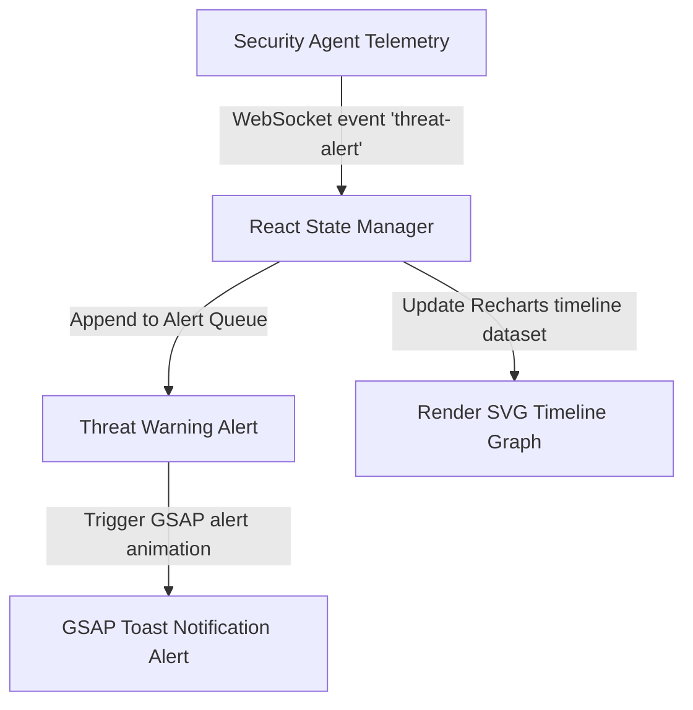

# Insider Guardian: Enterprise-Grade Endpoint Detection & Response (EDR) Dashboard

<div align="center">
  
</div>

<div align="center">
     
</div>

بوابة **Insider Guardian** هي واجهة تشغيل أمنية فائقة الجودة من نوع EDR مخصصة للمحللين الأمنيين لمراقبة تدفقات شبكة الخوادم، ورصد التهديدات السيبرانية الداخلية بشكل فوري عبر رسوم بيانية وتأثيرات بصرية حية.

This repository houses the high-fidelity React frontend dashboard and real-time visualization widgets for the **Insider Guardian Security Suite**. Built using advanced GSAP animations and Recharts tracking panels.

---

## 🧬 Threat Detection Telemetry Flow

The interface processes incoming WebSocket warning signals and updates dashboard states immediately:



---

## 🧬 UI Modules & Features

1.  **Real-Time Telemetry Monitor**: Timeline graphs tracking network operations, memory logs, and process updates.
2.  **Threat Alert Center**: Toast alert system animated via GSAP to draw analyst attention to high-risk events.
3.  **Active Connections Map**: SVG dashboard panels tracking server node health.

---

## 🛠️ Technology Stack & Styling Assets

*   **Structure**: Component-driven layout utilizing **React 18** and **Vite** bundler.
*   **Animation Engine**: **GSAP (GreenSock)** for smooth warning displays.
*   **Data Visualization**: **Recharts** for SVG charting components.
*   **Styling**: Modern dark mode dashboard layout optimized for low-light command environments.

---

## 📂 Repository Module Layout

```text
insider-guardian/
├── src/
│   ├── components/      # Reusable widgets (Charts, Alerts)
│   ├── styles/          # TailwindCSS and custom dashboard themes
│   ├── App.jsx          # Dashboard root layout
│   └── main.jsx         # Render entry point
├── package.json         # React metadata
└── README.md            # System documentation
```

---

## ⚡ Local Setup & Run
```bash
git clone https://github.com/Sayed-Herzallah/insider-guardian.git
cd insider-guardian
npm install
npm run dev
```

---

## 📄 License
Licensed under the **MIT License**.
