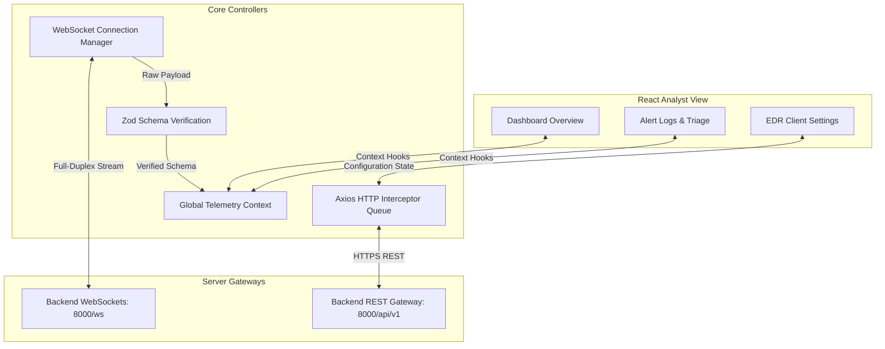

# InsiderGuardian: High-Fidelity Endpoint Detection & Response (EDR) Analyst Portal

<div align="center">
  
</div>

InsiderGuardian is a production-grade Endpoint Detection and Response (EDR) frontend interface engineered for Security Operations Centers (SOC). It ingests real-time endpoint telemetry, maps threat indicators, and facilitates immediate host isolation workflows. The client is optimized for low rendering overhead under high event velocity.

---

## ⚡ The Engineering Challenge

### Problem
SOC analysts monitoring enterprise networks receive thousands of endpoint events per second. Traditional security dashboards suffer from:
1. **Rendering Choke**: React re-render cascades caused by continuous WebSocket event ingestion.
2. **Session Expiry Breaches**: Inactive analyst tokens expiring in the middle of active incident triage, disrupting telemetry connection and API calls.
3. **Weak Schema Enforcement**: Unvalidated WebSocket payload formats causing runtime UI errors.

### Solution
InsiderGuardian solves these issues by:
* **Decoupled Render Pipeline**: Dynamic telemetry events are batched and parsed through custom hooks, updating high-performance charts with debounced repaint windows.
* **Resilient Connection Lifecycle**: Built-in Axios client interceptors catch authentication HTTP `401 Unauthorized` responses and automatically process JWT refresh token queues without interrupting active views.
* **Strict Type Contracts**: Every incoming websocket and REST payload undergoes type verification via `Zod` schema gates before entering React state.

---

## 🧬 Frontend System Architecture

The following diagram illustrates the internal client routing, state synchronization, and socket connection management:



---

## 🛠️ Technology Stack & Architecture Rationale

### Development & Build Runtime
* **React (v19)**: Selected for its concurrent rendering features, helping optimize high-rate state updates from backend event streams.
* **TypeScript (v5.x)**: Guarantees compile-time type-safety across telemetry logs and threat definitions.
* **Vite (v7.0)**: Used as the build tool for fast hot module replacement (HMR) and optimized rollup production bundles.
* **Tailwind CSS (v3.4)**: Allows highly customizable styling for custom dark mode design patterns suitable for night-shift SOC environments.

### Visualization & Micro-interactions
* **GSAP (GreenSock)**: Used for hardware-accelerated animations of critical alert notifications to keep UI transitions smooth.
* **Recharts**: High-performance charting primitives configured with responsive sizing to display threat severity distribution.
* **Radix UI**: Accessible design primitives (Modals, Dropdowns) forming the backbone of host isolation controls.
* **Zod**: Runtime validator checking backend API payload changes.

---

## 📂 System Core Modules

```text
src/
├── components/          # Stateless design components (Charts, Threat Cards, Modal Overlays)
├── config/              # Central configuration (Gateway Endpoints, Constants)
├── context/             # Auth Context and WS Telemetry State Provider
├── hooks/               # Custom hooks: useTelemetry (handles buffer queues), useDebounce
├── lib/                 # Core network wrappers (Axios Interceptors, WebSocket client)
├── pages/               # Top-level routes (Security Overview, Alerts, Analyst Settings)
└── types/               # Compile-time TypeScript interface schemas
```

---

## ⚡ Developer Execution & Local Run

### Prerequisites
* Node.js v20.x or higher
* npm v10.x or higher

### Environment Configuration
The application requires configuration of endpoints. Create or update a configuration file at `src/config/api.ts`:

```typescript
export const REST_BASE_URL = 'http://localhost:8000/api/v1';
export const WS_BASE_URL = 'ws://localhost:8000/ws/dashboard/';
```

### Installation and Boot
```bash
# 1. Clone client repository
git clone https://github.com/Sayed-Herzallah/insider-guardian.git
cd insider-guardian

# 2. Install production dependencies
npm install

# 3. Spin up development server (port defaults to 5173)
npm run dev

# 4. Compile and optimize for production
npm run build
```

---

## 📜 Architectural Decisions & Performance Audits
1. **Axios Token Interceptor Queue**: When a JWT token expires, subsequent REST requests are intercepted and put in a temporary queue. The client dispatches a singular request to retrieve a new token. Once obtained, the queue is drained automatically, avoiding multiple duplicate token requests.
2. **WebSocket Batching**: Telemetry event list updates are batched into 100ms intervals instead of triggering immediate state updates for every single payload, avoiding UI thread blocking.
