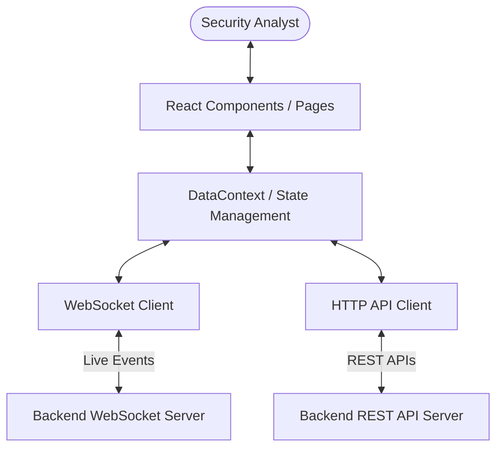

# Insider Guardian — Enterprise EDR Dashboard

[](https://react.dev/)
[](https://www.typescriptlang.org/)
[](https://vite.dev/)
[](https://tailwindcss.com/)
[](https://opensource.org/licenses/MIT)

Insider Guardian is a next-generation, enterprise-grade Endpoint Detection and Response (EDR) frontend dashboard. Engineered for Security Operations Centers (SOC), it enables security analysts to monitor real-time endpoint telemetry, investigate complex threat incidents, and orchestrate automated response playbooks through a high-fidelity, interactive interface.

---

## 📸 Architecture & Data Flow



---

## ⚡ Key Modules & Features

### 🛡️ Real-Time Security Operations
* **WebSocket Integration:** Live telemetry ingestion for instant threat alerts and endpoint state transitions.
* **Incident Management:** Full lifecycle tracking (New, Investigating, Contained, Resolved) with analyst note assignment.
* **Host Isolation:** Immediate threat mitigation capabilities to isolate compromised endpoints.

### 📊 Data Visualization & UX
* **Threat Metrics:** Dynamic charts utilizing **Recharts** to display threat severity distribution and endpoint health stats.
* **Premium Micro-interactions:** Fluid layouts and page transitions using **GSAP** (GreenSock) for a premium, hardware-accelerated user experience.
* **Responsive Dark-Mode:** High-contrast Tailwind CSS interface tailored for dark operations rooms.

### 🔒 Enterprise Robustness
* **Token Lifecycle Management:** Automatic JWT token refresh utilizing axios-like interceptors on HTTP `401 Unauthorized` responses.
* **Client-Side Validation:** Advanced schema validation for user authentication powered by **Zod**.
* **Strict Typing:** Written completely in strict TypeScript for runtime stability and self-documenting code.

---

## 🛠️ Tech Stack & Dependencies

| Technology | Category | Description |
| :--- | :--- | :--- |
| **React 19** | Core | Modern UI components with concurrent rendering support. |
| **TypeScript** | Language | Strict type definitions for application scalability. |
| **Vite** | Build Tool | Lightning-fast Hot Module Replacement (HMR) and bundling. |
| **Tailwind CSS** | Styling | Utility-first CSS framework for clean, responsive designs. |
| **GSAP** | Animation | Advanced physics-based micro-animations and layouts. |
| **Recharts** | Data Vis | Declarative charting library built on React components. |
| **Zod** | Validation | Type-safe schema validation for form submissions. |

---

## 🚀 Getting Started

### Prerequisites
* Node.js (v18.0.0 or higher)
* npm (v9.0.0 or higher)

### Installation

1. **Clone the repository:**
   ```bash
   git clone https://github.com/Sayed-Herzallah/insider-guardian.git
   cd insider-guardian
   ```

2. **Install project dependencies:**
   ```bash
   npm install
   ```

3. **Configure API Endpoints:**
   Edit the server endpoints in `src/config/api.ts` to point to your live backend server:
   ```typescript
   export const REST_BASE_URL = 'http://192.168.100.9:8000/api/v1';
   export const WS_BASE_URL = 'ws://192.168.100.9:8000/ws/dashboard/';
   ```

4. **Start the local development server:**
   ```bash
   npm run dev
   ```

5. **Build optimized production bundle:**
   ```bash
   npm run build
   ```

---

## 📁 Directory Structure

```text
├── src/
│   ├── components/     # Reusable UI widgets and layout modules
│   ├── config/         # System configuration & environment endpoints
│   ├── context/        # React Context providers (Authentication, WebSockets)
│   ├── hooks/          # Custom utility React hooks
│   ├── lib/            # REST and WebSocket API client wrappers
│   ├── pages/          # Complete page views (Overview, Alerts, Profile, etc.)
│   ├── types/          # Global TypeScript interfaces
│   ├── App.tsx         # Root layout and view coordinator
│   └── main.tsx        # Application mount point
```

---

## 📄 License

This project is licensed under the MIT License. See [LICENSE](LICENSE) for details.
